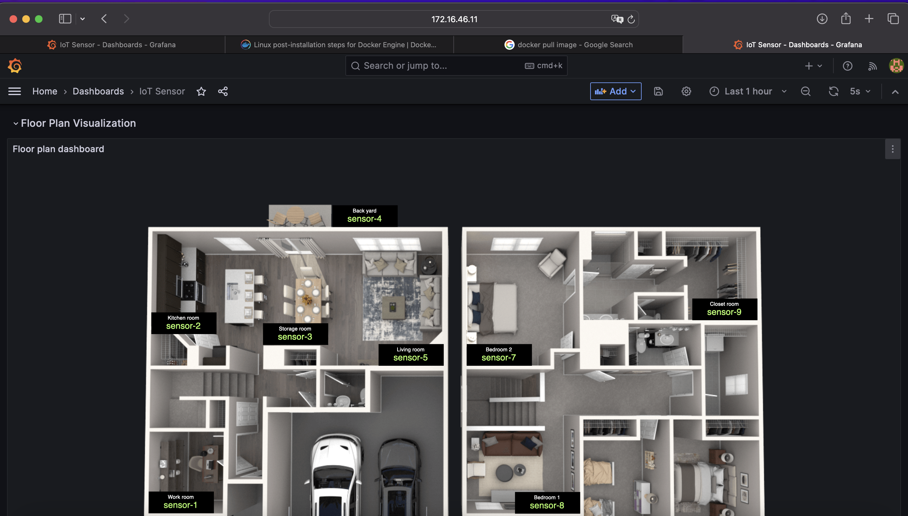

# IoT Docker compose

## How to start docker compose

> "Note" 🚨 สิ่งแรกที่ต้องทำ คือ การเข้าไปในตำแหน่งของ docker-compose.yml ภายใน Project Directory ก่อน จึงจะสามารถ start docker compose ได้

### การ Start Docker Compose สามารถทำได้ วิธี

1.  Basic Start

```bash
docker compose up
```

> การรันแบบนี้จะขึ้น log ของ Container ทุกตัวพร้อมกัน หากอยากดูทีละตัวให้ใช้ command ที่หัวข้อ Command เพิ่มเติม

2.  Start with "Deamon" (รันแบคกราวน์)

```bash
docker compose up -d
```

### Command เพิ่มเติม

บางครั้งเราก็ไม่อยากดู log ของทุก Container พร้อม ๆ กัน
ซึ่งเราสามารถดู log การทำงานของแต่ละ Container ภายใต้ Compose ได้โดยใช้

```bash
docker compose logs -f "container_name" # formation
docker compose logs -f mongo # example
```

> ➕ ดู log ของ Container ทุกตัว

```bash
docker compose logs -f
```

## Error we found
Error ที่พวกผมได้เจอนั้นมี 4 ปัญหาของ แต่ละ Container ดังนี้
* Zookeeper Navigator error
* Mongo error
* Mosquitto error
* IOT processor error

## How to solve the problems.
* Zookeeper Navigator นั้นมีปัญหาโดยไม่สามารถดึง Image ได้ โดยมีวิธีการแก้ปัญหาในตอนนี้คือ Comment ในส่วนนี้เอาไว้ก่อน
* Mongo มีปัญหาที่ version ของ Mongo นั้นมี version ที่สูงเกินไป โดยเราได้ทำการ Drop version ของ Mongo ลงมา 1 version โดยแก้ตรงไฟล์ Docker-compose ที่ Container Mongo หัวข้อ Image จาก version ล่าสุด เป็น version 4.6.6
* Mosquitto มีปัญหาที่การเข้าถึงนั้น เราไม่สามารถ เชื่อมต่อได้เนื่องจากไม่มีไฟล์สำหรับการ Config Mosquitto จึงต้องทำการสร้างไฟล์ config โดยการ copy ไฟล์ ที่มีอยู่ใน Container path โดยใช้คำสั่ง จากนั้นแก้ไฟล์โดยให้บุคคลใดก็ได้สามารถเข้าถึงได้
* IOT processor สามารถแก้ไขโดยการที่ต้องทำการ Restart kafka และ iot-processor ซึ่งสามารถสังเกตได้จาก log ของ iot-processor ถ้ามีข้อความว่า Shutdown Complete แปลว่าไม่สามารถส่งข้อมูลขึ้น Grafana ได้จะต้องทำการ restart iot-processor จนกว่าจะไม่มีข้อความ Shutdown Complete และ อีกสาเหตุเกิดจากการที่ IP ของเครื่อง Server ภายในห้องมี IP ที่ซ้ำกันทำให้เกิดอาการที่ Server หลุดจึงจะได้ต้องทำการเช็ค IP อย่างรอบคอบว่าไม่มีเครื่องไหนที่ใช้ซ้ำกัน

```bash
docker cp CONTAINER_Name:Container_path local_disk
```

## Output

- [ ] IoT Sensor - Dashboards - Grafana
- [ ] UI for Apache Ka
- [ ] Mongo Expr
- [ ] Node Expor
- [ ] Prometheus Time Series Collection and Processing Ser
- [ ] Prometheus Pushgateway
- [ ] ZooNavigator

### IoT Sensor - Dashboards - Grafana URL

</br>
    โดย Dashboards ไว้สำหรับการ Visualization Data ในรูปแบบของ Real Time

### UI for Apache Kafka

### Mongo Express

### Node Exporter

### Prometheus Time Series Collection and Processing Server

### Prometheus Pushgateway

### ZooNavigator
