# Data Visualization.

<p align="center">
  
  
</p>

การสร้าง Dashboard สำหรับ Visualization เพื่อดูค่า data ที่เรารับมานั้น ในขั้นตอนนี้เราจะใช้ framework ที่ชื่อว่า **_"Grafana"_** ร่วมกับ plugin ที่ชื่อว่า **_"FlowCharting"_**
ที่จะช่วยสร้างแผนผังสถานที่เพื่อให้ UX ดียิ่งขึ้น ซึ่งการสร้างผังสถานที่ที่ต้องการ เราจะผ่านการทำใน **_"Draw.io"_** ที่เชื่อมอยู่ภายใน library

> Grafana จะถูกรันเป็น container ภายใต้ compose ที่มาจาก https://github.com/sergio11/iot_event_streaming_architecture ทำให้ขั้นตอนจะเริ่มที่การติดตั้ง FlowCharting

## Let's start 🚀

## <mark>การติดตั้ง FlowCharting Plugins</mark>

</br>

### **_1. Mount Volumn ใน Grafana เพื่อเก็บ plugins_**

ในการติดตั้งนั้น อย่างแรกที่ต้องทำ คือ การ mount volumn ของ container ให้ถูกต้อง เพื่อป้องกันไม่ให้ plugin ที่เรากำลังจะลงหายไปเวลาเราสั่ง down container โดยควร mount volumn ดังนี้

```yml
grafana:
  image: grafana/grafana:9.5.20-ubuntu
  container_name: grafana
  user: "0"
  volumes:
    - ./grafana/data:/var/lib/grafana # path ที่เก็บ data ต่าง ๆ รวมถึง plugins
    - ./grafana/dashboards:/etc/grafana/provisioning/dashboards
    - ./grafana/datasources:/etc/grafana/provisioning/datasources
  environment:
    - GF_SECURITY_ADMIN_USER=${ADMIN_USER:-admin}
    - GF_SECURITY_ADMIN_PASSWORD=${ADMIN_PASSWORD:-admin}
    - GF_INSTALL_PLUGINS=grafana-clock-panel,grafana-worldmap-panel,grafana-piechart-panel
    - GF_USERS_ALLOW_SIGN_UP=false
  restart: unless-stopped
  links:
    - prometheus
  ports:
    - "8085:3000"
```

หลังจาก mount volumn เรียบร้อยก็สามารถรัน grafana ได้เลย

</br>

### **_2. ติดตั้ง FlowCharting_**

ขั้นตอนการติดตั้งมีดังนี้

#### 1. เข้าไปใน container ของ grafana

```bash
docker exec -it grafana /bin/bash
```

#### 2. cd เข้าไปใน plugin directory

```bash
cd /var/lib/grafana/plugins
```

#### 3. สร้าง directory มา 1 directory ด้วยชื่ออะไรก็ได้ เพื่อรอเก็บ plugin file ที่เราจะทำการ get และ cd เข้าไป

```bash
mkdir flowcharting
cd flowcharting
```

#### 4. โหลด plugin โดยการใช้ wget ตามด้วยลิงค์ zip file

```bash
wget https://github.com/skyfrank/grafana-flowcharting/releases/download/v1.0.0e/agenty-flowcharting-panel-1.0.0e.231214594-SNAPSHOT.zip
```

> plugin source >>> https://github.com/skyfrank/grafana-flowcharting/releases/tag/v1.0.0e

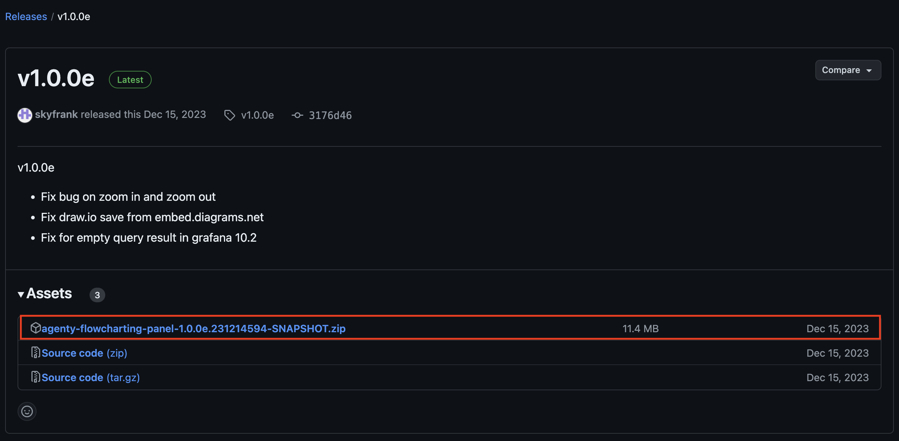
</br>

#### 5. extract zip file ด้วยการใช้ unzip

```bash
unzip agenty-flowcharting-panel-1.0.0e.231214594-SNAPSHOT.zip -d ../grafana-flowcharting
```

#### 6. แก้ไขให้ grafana รองรับ angular plugin ได้เนื่องจาก grafana เวอร์ชั่นใหม่ ๆ ไม่รองรับแล้ว แต่เราแก้ไขได้

- เข้าไปใน path /etc/grafana

```bash
cd /etc/grafana
```

- แก้ไขไฟล์ grafana.ini

```bash
vim grafana.ini
```

- ทำการหา keyword คำว่า angular โดยการใช้
  > ใช้ได้เฉพาะการหาคำในการใช้งาน vim เท่านั้น

```bash
/angular
```

- แก้ไขให้เป็น true

```bash
angular_support_enabled = true
```

</br>

---

**หลังจากทำ 6 ขั้นตอนเสร็จสิ้นแล้วให้ทำการออกมาจาก container ของ grafana และ restart grafana**

```bash
docker compose restart grafana
```

**จากนั้นก็เข้าไปใน grafana ผ่าน browser เพื่อตรวจสอบว่ามี plugin ชื่อ FlowCharting ติดตั้งแล้วหรือยัง ถ้ามีแสดงว่าติดตั้งสำเร็จแล้ว**

---

</br>

## <mark>การใช้งาน FlowCharting</mark>

ในตัวอย่างนี้เราจะทำการสร้าง floor plan มาเพื่อจำลองการทำ smart home ที่มี sensor ต่าง ๆ อยู่ตามจุดภายในบ้าน ซึ่งขั้นตอนการทำมีดังนี้

### 1. การสร้าง floor plan หรืออื่น ๆ ตามต้องการ

1. กด add เพื่อเพิ่ม widget ในหน้า dashboard โดยการเลือก FlowCharting และเราจะได้ chart เริ่มต้นของ plugin นี้มาดังรูป


</br>

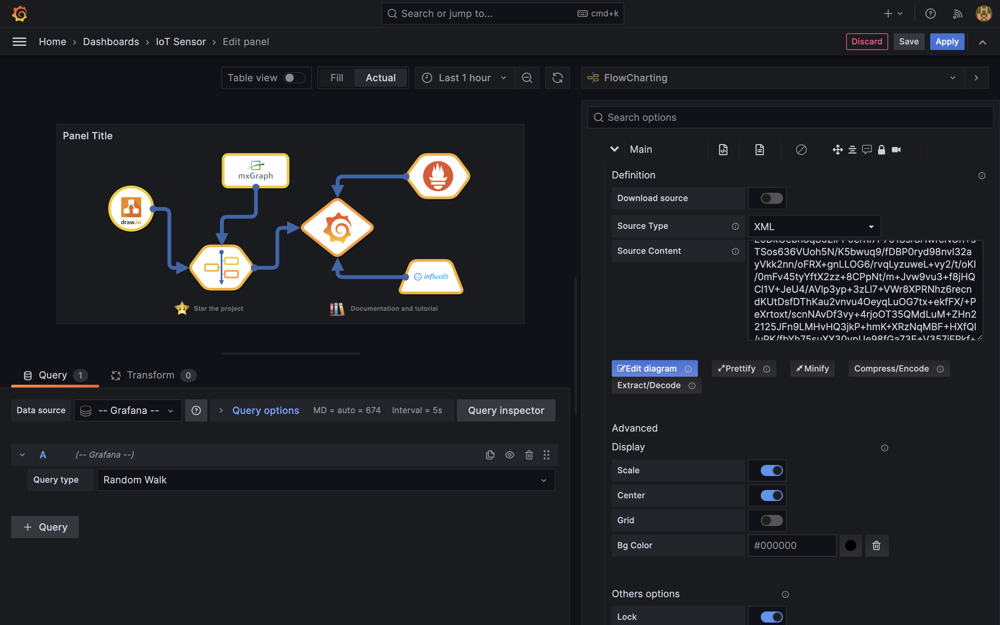
</br>

2. กดปุ่ม edit diagram โดยตัวระบบจะลิงค์เราไปที่หน้าของ draw.io เพื่อให้เราแก้ไข โดยเราสามารถใส่ floor plan เป็นรูป หรือทำเป็น diagram ก็ได้ (จริง ๆ สามารถทำบน local แล้ว export เป็น SVG หากใช้รูป หรือ xml ไปใช้งานได้เช่นกัน)

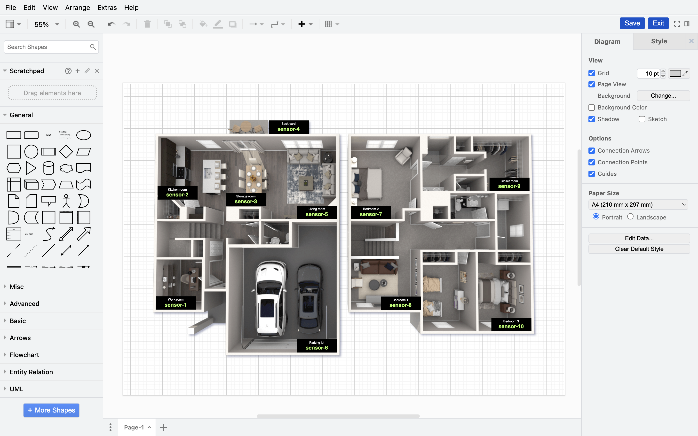
</br>

โดยผมเลือกเป็นการนำรูป floor plan บ้านเข้ามา จากนั้นก็ทำการเพิ่มบล็อกสี่เหลี่ยมสีโปร่งใส ไปตามจุดที่เราต้องการจะแสดงค่าเซ็นเซอร์ เพื่อไว้ใช้กำหนดในการ map ค่าเซ็นเซอร์ต่าง ๆ ใน grafana (ค่าเซ็นเซอร์จะถูกแสดงอยู่ในบล็อกที่เรากำหนด) รวมถึงการเพิ่มตัวหนังสือ หรือการปรับแต่งขนาด, สี, ความหนา ของตัวหนังสือที่เราใช้แสดงค่าเซ็นเซอร์ก็สามารถทำได้เช่นกัน

> ตัวอย่างการเพิ่มบล็อกสี่เหลี่ยมสีโปร่งใส ไปตามจุดที่เราต้องการจะแสดงค่าเซ็นเซอร์

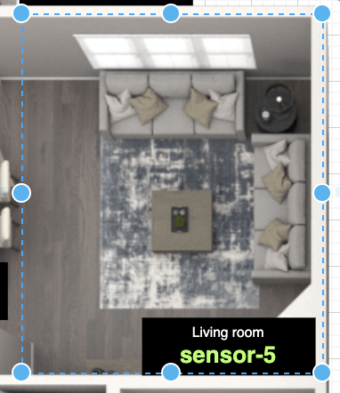
</br>

> ตัวอย่างการปรับแต่งตัวหนังสือเพื่อใช้แสดงค่าเซ็นเซอร์ในบล็อกที่เราสร้าง

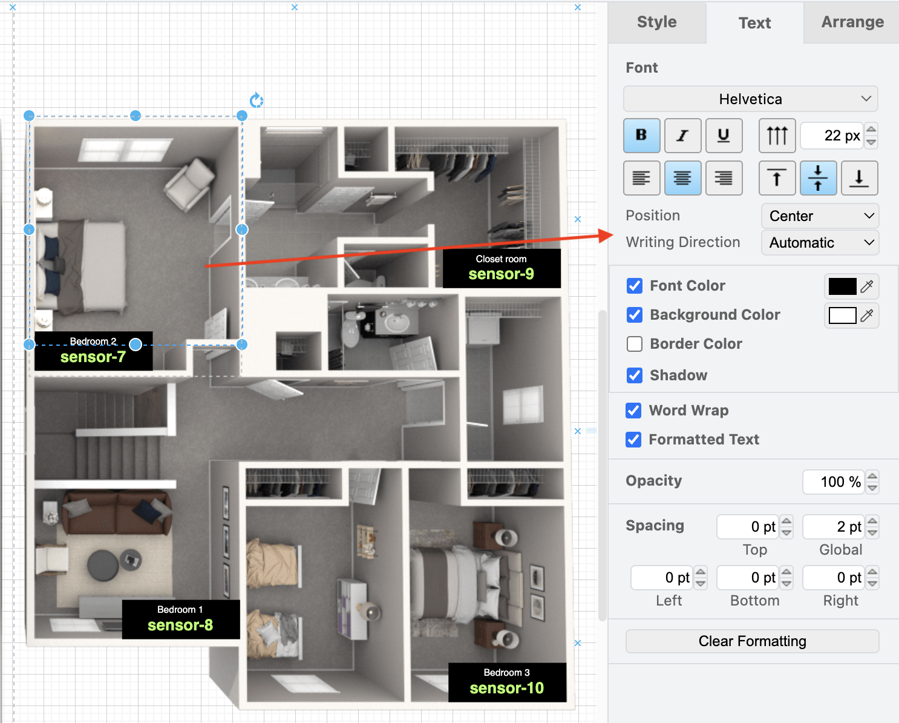
</br>

3. หลังจากตกแต่งเสร็จสิ้น ให้ทำการกด save ที่มุมขวาบน จากนั้นตัวระบบจะพาเรากลับมาที่หน้า grafana

### 2. การแสดงผลค่าเซ็นเซอร์กับ floor plan ที่เราสร้าง

การที่เราจะนำค่ามาแสดงนั้น ด้วยความที่ค่าทั้งหมดตอนนี้ถูกดึงมาจากการใช้งาน Prometheus ทำให้เราสามารถ query ค่าออกมาใช้งานได้ โดยมีขั้นตอนดังนี้

</br>

<mark>1. การ query ค่าจาก Prometeus
</br>
</br>

- เลือก Data source เป็น Prometheus เพราะเราใช้ Prometheus ในการดึง streaming data
  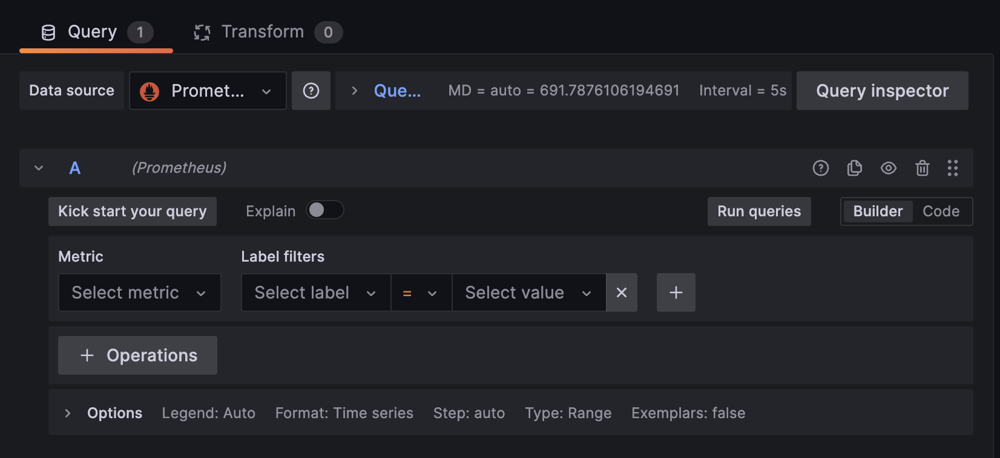
  </br>
- select metric เป็นค่าที่เราอยากใช้มาแสดง เช่น **_sample_sensor_metric_temperature_**
  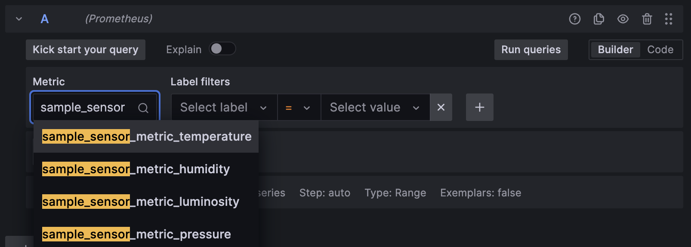
  </br>
- เลือก key ที่มีค่าที่ต้องการนำมาแสดงผ่านหัวข้อ options (ค่า payload จาก iot_sensors ต่าง ๆ) โดยในตัวอย่างนี้เราจะเลือกเป็น sensor_name
  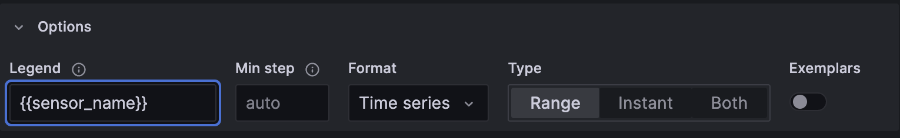
  </br>
- กด run queries เพื่อดึงค่าข้อมูล

  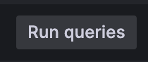
  </br>

</br>

<mark>2. การ map ค่าสีและค่าเซ็นเซอร์ที่เราได้ลงบน floor plan
</br>
</br>

- ไปที่หัวข้อ Rules (สามารถตั้งชื่อ rule ได้)

- เลือกค่าที่ต้องการแสดง ที่ช่อง set metrics ซึ่งจะขึ้นให้เลือกตามค่าที่เราทำการ query มา

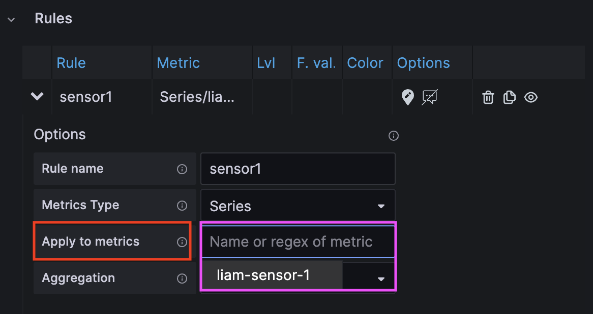
</br>

- เลือกหน่วยของค่าที่ต้องการแสดงตามค่าที่ query มา

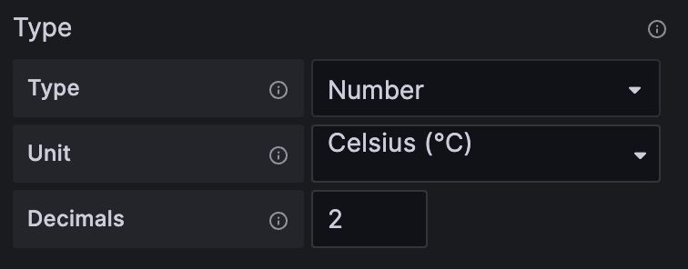
</br>

- เลือกประเภทค่าที่จะมาแสดง เช่น AVG, Last, หรือ Min แต่ในกรณีนี้ผมจะเลือกเป็น AVG เพื่อให้ค่าแสดงผลตรงกับ widget อื่น ๆ ที่มีอยู่แล้วบน dashboard

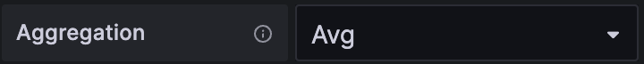
</br>

- ไปที่หัวข้อ map color และ map text แล้วกดสัญลักษณ์ link จากนั้นให้กดไปที่ตำแหน่งบน floor plan ที่ต้องการจะแสดงผลค่าเซ็นเซอร์ ถ้าถูกต้อง ที่รูป floor plan จะขึ้นโชว์ว่าเราได้ทำการกดเลือกตรงไหนเพื่อแสดงค่า

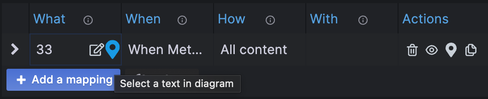
</br>

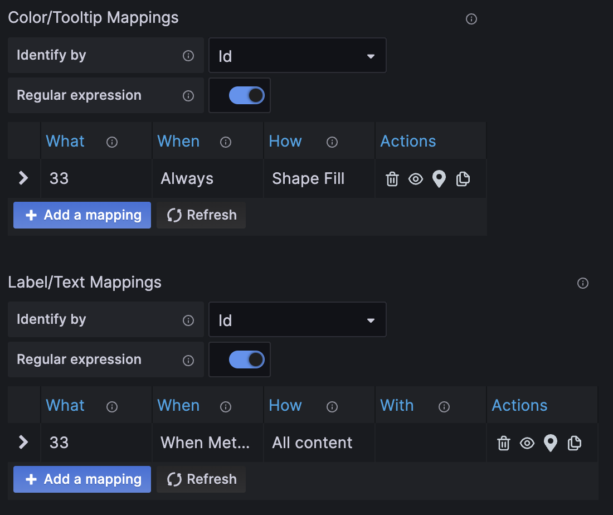
</br>

จะเห็นได้ว่าสีและค่าที่ query มาได้ขึ้นไปอยู่บนกรอบ floor plan ที่เราสร้างเรียบร้อย

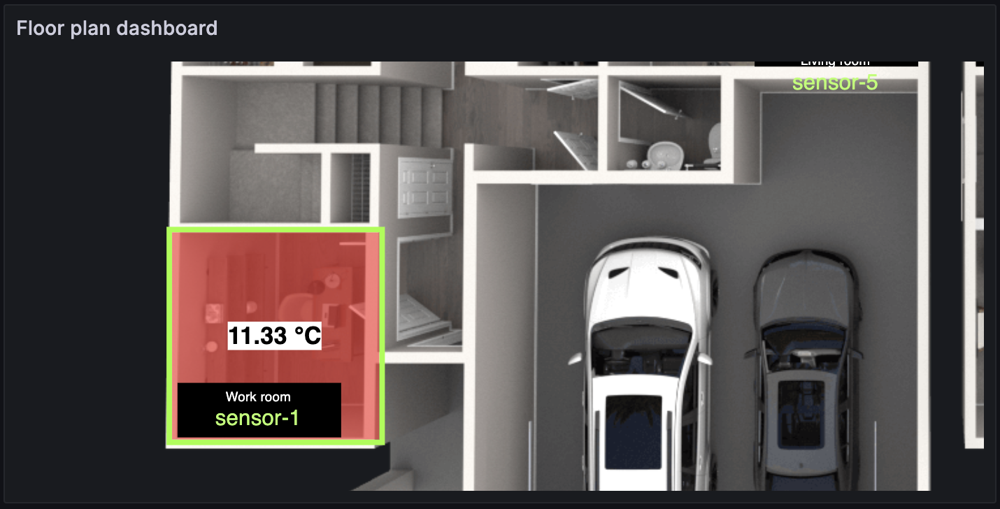
</br>

- สุดท้าย กำหนดค่า treshold ของสีที่ใช้แสดงว่า ถ้าค่าใน range ไหนให้สีอะไร ตามความต้องการและความเหมาะสมของค่าข้อมูล เช่น หากเราเลือกใช้ค่าอุณหภูมิ ก็อาจจะตั้งให้ค่าสีเป็นไปตาม range ที่ว่าหากอุณภูมิเกิน 30 ให้ขึ้นสีแดงเพื่อเหมือนให้เข้าใจว่าอุณหูมิสูงเกินแล้ว เป็นต้น

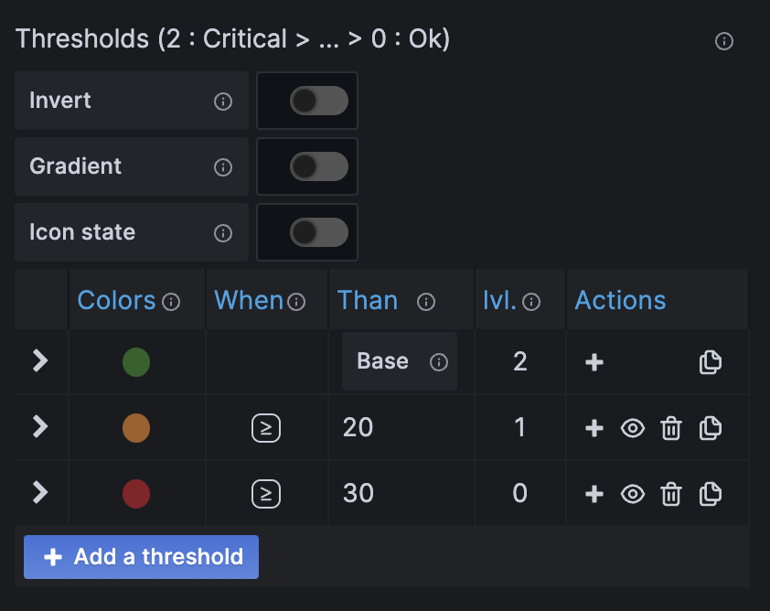
</br>

สุดท้าย ให้เราทำให้ครบตามจำนวนเซ็นเซอร์ที่มี เพื่อให้แสดงค่าอย่างครบถ้วน จากนั้นกด save แล้ว apply ก็จะได้ dashboard ที่มีการแสดงผลค่าเซ็นเซอร์บน floor plan ครบถ้วนและเสร็จสิ้น

> Rules ทั้ง 10 เซ็นเซอร์

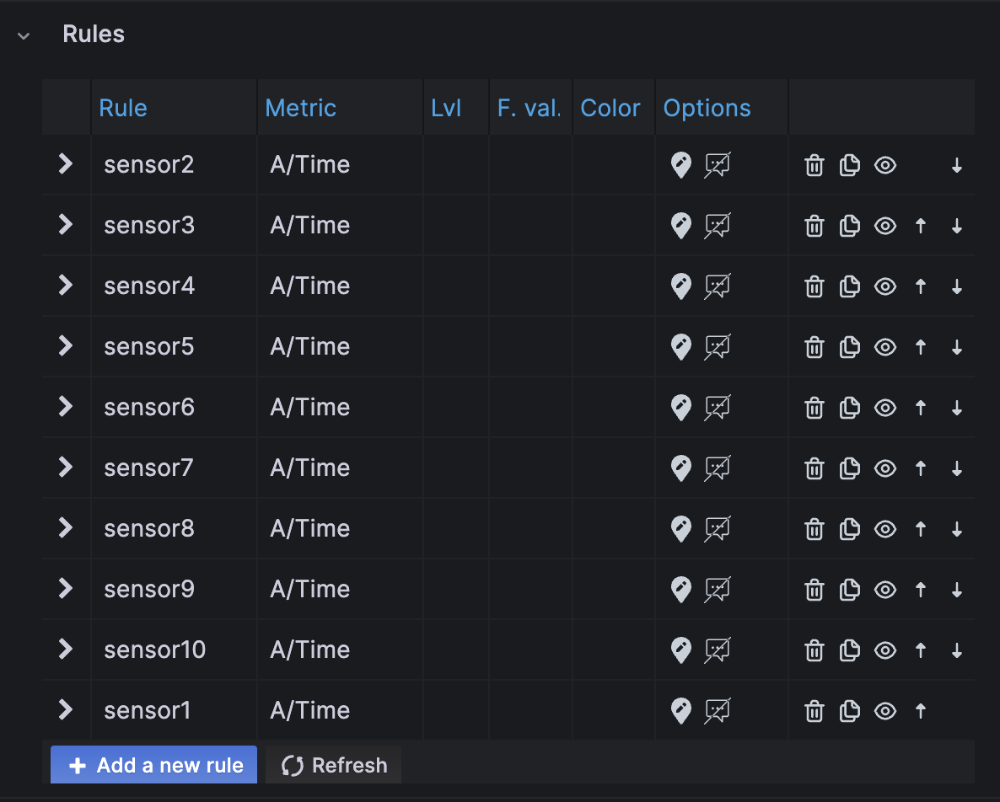
</br>

## <mark>สรุปภาพรวม</mark>

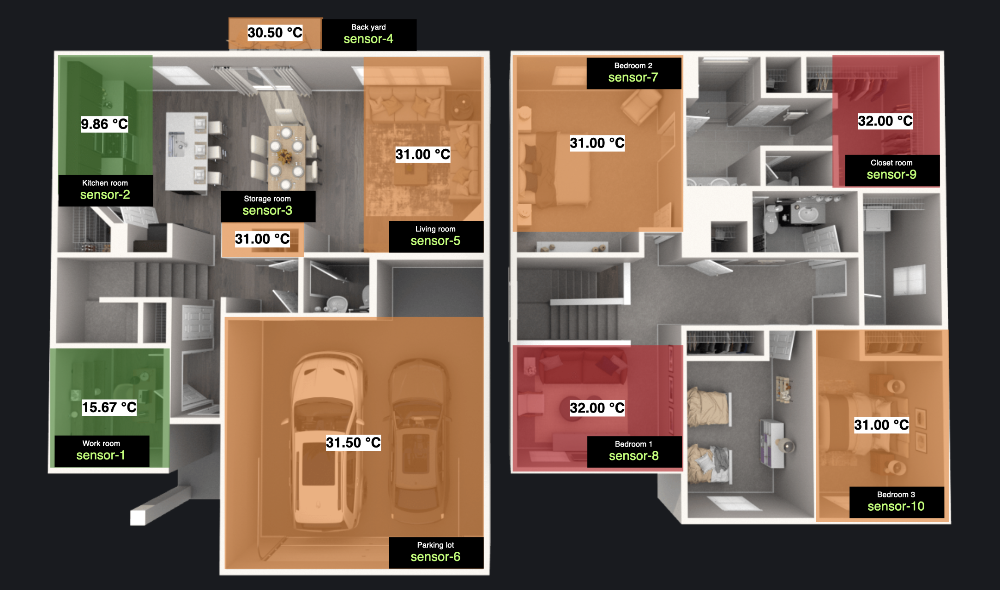
</br>
